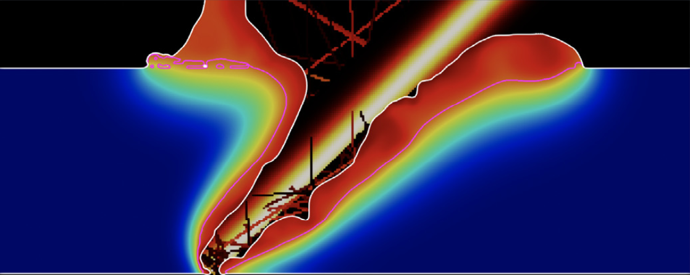

 

# Welcome

Welcome to the landing page of the **Laser Melting Suite**. This is a collection of solvers for OpenFOAM, which are used to solve various problems in computational fluid dynamics (CFD) and other fields. The solvers are designed to be easy to use and flexible, allowing users to customize them for their specific needs.

# What is the Laser Melting Suite?

The **Laser Melting Suite** is a collection of **OpenFOAM** solvers and utilities designed for simulating laser melting processes in Laser Powder Bed Fusion, selective laser melting, laser welding and many other.

The suite includes solvers for both 2D and 3D simulations. The solvers are designed to be easy to use and flexible, allowing users to customize them for their specific needs.

# Where do I start?

* The [Solvers](solvers/solvers.html) page provides a list of available solvers and their descriptions along with some tutorials and guides on installations.
* The [Utilities](utilities/utilities.html) page provides a list of available utilities, their use and installation instructions.
* The Documentation page is present within every solver page and it provides a description of the algorithms and equations used in the solvers and utilities.
* The [Publications](publications/publications.html) page provides the list of resreach papres relevant to a specific solver. Make sure to check out the [how to cite](how_to_cite/how_to_cite.html) page if you are planning to use one of the solvers for a publication.
