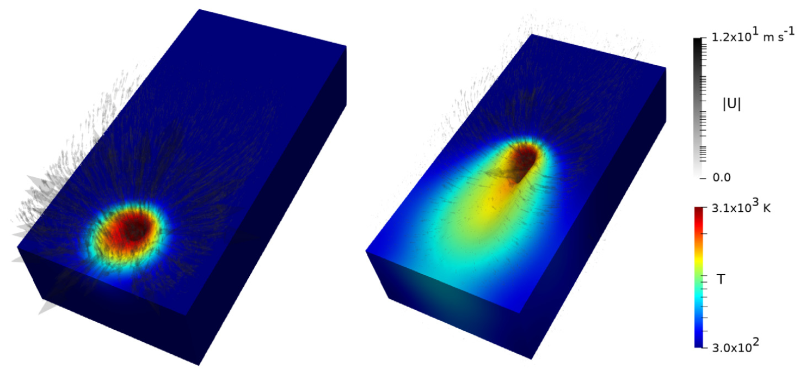

# beamWeldFoam

 

## Source code

[beamWeldFoam GitHub repository (OpenFOAM 6)](https://github.com/tomflint22/beamWeldFoam){:target="_blank"}  
[beamWeldFoam GitHub repository (OpenFOAM 10)](https://github.com/tomflint22/beamWeldFoam/tree/OF10){:target="_blank"} 

## Overview
Presented here is the extensible open-source volume-of-fluid (VOF) solver beamWeldFoam, for studying high energy density advanced manufacturing processes. In this implementation the metallic substrate, and shielding gas phase, are treated as in-compressible. The solver fully captures the fusion/melting state transition of the metallic substrate. For the vapourisation of the substrate, the explicit volumetric dilation due to the vapourisation state transition is neglected, instead, a phenomenological recoil pressure term is used to capture the contribution to the momentum and energy fields due to vaporisation events. beamWeldFoam also captures surface tension effects, the temperature dependence of surface tension (Marangoni) effects, latent heat effects due to melting/fusion (and vapourisation), buoyancy effects due to the thermal expansion of the phases using a Boussinesq approximation, momentum damping due to solidification, and a representative heat source description of an incident laser/electron beam heat source. The heat source can also be modified to be representative of arc-welding processes.
The solver approach is based on the adiabatic two-phase interFoam code developed by [OpenCFD Ltd.](http://openfoam.com/). Target applications for beamWeldFoam include:

* Laser Welding
* Electron Beam Welding
* Arc Welding
* Additive Manufacturing

## Algorithm

Initially the solver loads the mesh, reads in fields and boundary conditions, reads certain mesh information into arrays (for the heat source application), selects the turbulence model (if specified). The main solver loop is then initiated. First, the time step is
dynamically modified to ensure numerical stability. Next, the two-phase fluid mixture properties and turbulence quantities are updated. The discretized phase-fraction equation is then solved for a user-defined number of subtime steps (typically 3) using the multidimensional universal limiter with explicit solution solver [MULES](https://openfoam.org/release/2-3-0/multiphase/). This solver is included in the OpenFOAM library, and performs conservative solution of hyperbolic convective transport equations with defined bounds (0 and 1 for α1). Once the updated phase field is obtained, the program enters the pressure–velocity loop, in which p and u are corrected in an alternating fashion. In this loop T is also solved for, such that he buoyancy predictions are correct for the U and p fields. The process of correcting the pressure and velocity fields in sequence is known as pressure implicit with splitting of operators (PISO). In the OpenFOAM environment, PISO is repeated for multiple iterations at each time step. This process is referred to as merged PISO- semi-implicit method for pressure-linked equations (SIMPLE), or the pressure-velocity loop (PIMPLE) process, where SIMPLE is an iterative pressure–velocity solution algorithm. PIMPLE continues for a user specified number of iterations. 
The main solver loop iterates until program termination. A summary of the simulation algorithm is presented below:
* beamWeldFoam Simulation Algorithm Summary:
  * Initialize simulation data and mesh 
  * WHILE t<t_end DO
  * 1. Update delta_t for stability
  * 2. Phase equation sub-cycle
  * 3. Update interface location for heat source application
  * 4. Update fluid properties
  * 5. PISO Loop
    * 1. Form u equation
    * 2. Energy Transport Loop
      * 1. Solve T equation
      * 2. Update fluid fraction field
      * 3. Re-evaluate source terms due to latent heat
    * 3. PISO
        * 1. Obtain and correct face fluxes
        * 2. Solve p-Poisson equation
        * 3. Correct u
  * 6. Write Fields
  
Two sample tutorial cases, i.e. Gallium Meliing, and Sen and Davies cases are in strong agreement with experimental and analytical data available in the literature and serve as the validation cases for the implementation in beamWeldFoam.

## License
OpenFoam, and by extension the beamWeldFoam application, is licensed free and open source only under the [GNU General Public Licence version 3](https://www.gnu.org/licenses/gpl-3.0.en.html). One reason for OpenFOAM’s popularity is that its users are granted the freedom to modify and redistribute the software and have a right of continued free use, within the terms of the GPL.

## Acknowledgements
The work was generously supported by the Engineering and Physical Sciences Research Council (EPSRC) under the ''Cobalt-free Hard-facing for Reactor Systems'' grant EP/T016728/1, and Science Foundation Ireland (SFI), co-funded under European Regional Development Fund and by I-Form industry partners, grant 16/RC/3872.

## Citing This Work
If you use beamWeldFoam in your work. Please use the following to cite our work:

Thomas F. Flint, Gowthaman Parivendhan, Alojz Ivankovic, Michael C. Smith, Philip Cardiff,
beamWeldFoam: Numerical simulation of high energy density fusion and vapourisation-inducing processes,
SoftwareX,
Volume 18,
2022,
101065,
ISSN 2352-7110,
https://doi.org/10.1016/j.softx.2022.101065

## References
* Kay Wittig and Petr A Nikrityuk 2012 IOP Conf. Ser.: Mater. Sci. Eng. 27 012054
* Sen, A., & Davis, S. (1982). Steady thermocapillary flows in two-dimensional slots. Journal of Fluid Mechanics, 121, 163-186. doi:10.1017/S0022112082001840
* Sabina L. Campanelli, Giuseppe Casalino, Michelangelo Mortello, Andrea Angelastro, Antonio Domenico Ludovico, Microstructural Characteristics and Mechanical Properties of Ti6Al4V Alloy Fiber Laser Welds
